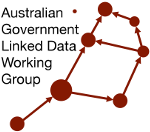

# AGLDWG PID Register - Data

This repository contains the source data for the [Australian Government Linked Data Working Group](https://www.linked.data.gov.au) (AGLDWG)'s Persistent Identifier (PID) register. The register maintains PIDs within the `linked.data.gov.au` namespace.

## The Register(s)

This Register has multiple sub-registers within it, for different classes of things:

* PIDs
  * `linked.data.gov.au/(dataset|def|org|pid)/`
  * persistent identifiers
* Organisations
  * `linked.data.gov.au/org/`
  * any organisation that submits PID requests to the AGLDWG
  * e.g. the Department of Finance, [`https://linked.data.gov.au/org/finance`](https://linked.data.gov.au/org/finance)* 

Within the PID register indicated above, there are several child registers containing specalised classes of PID:

* Datasets
  * `linked.data.gov.au/dataset/`
  * Linked Data datasets online
  * e.g. [`https://linked.data.gov.au/dataset/bdr`](`https://linked.data.gov.au/dataset/bdr`)
* Definitional Items
  * `linked.data.gov.au/def/`
  * Linked Data ontologies, vocabularies, profiles, etc.
  * e.g. the [ICSM](https://linked.data.gov.au/org/icsm)'s national _Address Model_, [`https://linked.data.gov.au/def/addr`](https://linked.data.gov.au/def/addr)
* Registered PIDs
  * `linked.data.gov.au/pid/`
  * persistent identifiers for the metadata of registered PIDs
  * for example, the PID for the PID [`https://linked.data.gov.au/dataset/bdr`]([`https://linked.data.gov.au/dataset/bdr`](`https://linked.data.gov.au/dataset/bdr`) - the PID used to identify [DCCEEW](https://linked.data.gov.au/org/dcceew)'s [Biodiversity Data Repository](https://bdr.gov.au/)'s main dataset - is `https://linked.data.gov.au/pid/dataset/bdr`.

## Creating PIDs

PIDs for PID Registrations and Organisations redirect to AGLDWG-managed metadata in the AGLDWG's PID Register Knwoledge Graph. PIDs for Datasets and Definitional Items resolve to whatever resources PID registrants nominate. 

The AGLDWG creates PIDs according to its [Guidelines](https://www.linked.data.gov.au/guidelines). PIDs, once approved, are automatically enabled through extraction of redirect information from this catalogue and automated deployment to the PID Proxy server at `linked.data.gov.au`.

Please refer to the -guidelines_ page linked to above for more details about who can and how to make PIDs.

## License

All the content of this repository is licensed with the [Creative Commons Attribution 4.0 International](https://creativecommons.org/licenses/by/4.0/) license with the following copyright notice:

&copy; Commonwealth of Australia (Australian Government Linked Data Working Group), 2026

## Contact

For all matters relating to this repository and the registry that it supports, please contact:

**Australian Government Linked Data Working Group**  
<linkeddatairi@ardc.edu.au>  
<https://www.linked.data.gov.au>
